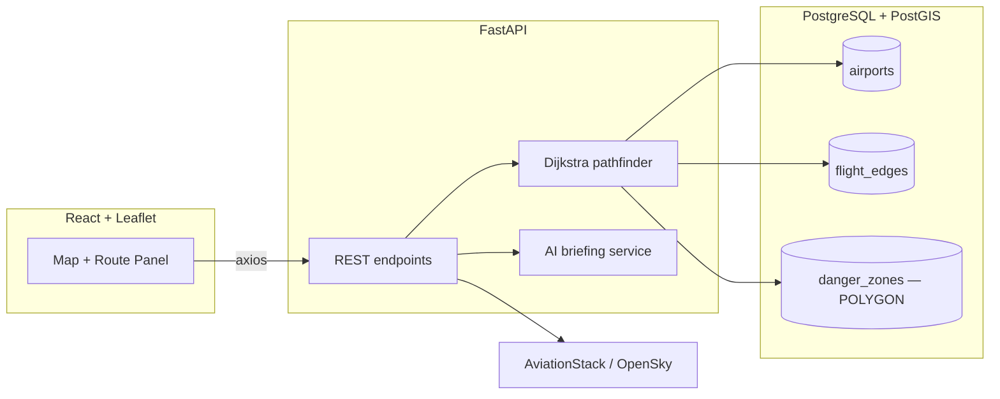

# Risk Aggregator v2.5 — Global Threat & Routing Engine

A spatial routing engine that plans flight paths around real-world hazards.
Given an origin and destination airport, it computes both the direct route
and a hazard-aware route, using PostGIS geometry to detect when a path
crosses an active danger zone (conflict airspace, severe weather) and a
custom Dijkstra implementation to route around it.

<!--
  TODO: add a screenshot/GIF here — drop the file at docs/screenshot.png and
  add `` above this comment.
  Run the app (see Quickstart) and grab one showing a rerouted path,
  e.g. IST -> DXB or IST -> HND.
-->

## What it does

1. Pick an origin and destination from 36 seeded global airport hubs.
2. The backend runs Dijkstra twice — once ignoring risk, once penalizing
   edges that intersect a danger zone polygon — and returns both paths.
3. The frontend renders both on a dark-mode Leaflet map: the blocked direct
   path (dashed red) and the safe rerouted path (solid blue), plus a live
   AI-generated briefing and real scheduled flights on the route
   (AviationStack) fetched for context.

## Architecture



| Layer | Stack |
|---|---|
| Frontend | React, React-Leaflet, Axios, custom CSS (dark-mode) |
| Backend | FastAPI, SQLAlchemy, GeoAlchemy2 |
| Database | PostgreSQL + PostGIS (`POINT` airports, `POLYGON` danger zones) |
| Routing | Hand-rolled Dijkstra (`backend/services/pathfinder.py`) with Shapely spatial-intersection penalties |
| Live data | OpenSky Network (aircraft positions), AviationStack (scheduled flights) |
| AI | OpenAI-generated route briefing, with a deterministic offline fallback when no API key is set |

## How routing works

Each `flight_edge` is weighted by great-circle distance plus a penalty if the
edge's flight path intersects any `danger_zones` polygon (checked in Python
with Shapely, using WKB geometry loaded from PostGIS). The engine runs
Dijkstra twice — once with penalties disabled (`standard_route`) and once
with them enabled (`safe_route`) — and the frontend diffs the two paths to
decide what to render.

See [`backend/services/pathfinder.py`](backend/services/pathfinder.py).

## Quickstart

### Backend

```bash
# 1. Local PostgreSQL + PostGIS (one-time)
brew install postgresql@17 postgis
brew services start postgresql@17
createdb risk_aggregator
psql -d risk_aggregator -c "CREATE EXTENSION postgis;"

# 2. Python environment
cd backend
python3 -m venv venv
venv/bin/pip install -r requirements.txt
cp .env.example .env   # defaults already point at the local DB above

# 3. Seed and run
venv/bin/python seed.py
venv/bin/uvicorn main:app --reload --port 8000
```

API docs: `http://localhost:8000/docs`

### Frontend

```bash
cd frontend
npm install
npm run dev
```

App: `http://localhost:5173`

### Optional: live flight data

Set `AVIATIONSTACK_KEY` in `backend/.env` (free tier at
[aviationstack.com](https://aviationstack.com)) to see real scheduled
flights on the selected route. OpenSky aircraft positions work with no key.

## API

| Endpoint | Description |
|---|---|
| `GET /api/airports` | All seeded airports with coordinates and risk metadata |
| `GET /api/danger-zones` | All danger zone polygons as GeoJSON |
| `POST /api/route/calculate` | `{origin, destination}` → standard + safe route |
| `POST /api/route/briefing` | AI-generated summary of a computed route |
| `GET /api/live-flights` | Live aircraft positions (OpenSky) |
| `GET /api/live-flights/{dep}/{arr}` | Real scheduled flights for a route (AviationStack) |

## Known limitations

Being upfront about the current state rather than overselling it:

- **Route safety is a soft constraint, not a verified guarantee.** The
  pathfinder heavily penalizes edges that cross a danger zone, but if
  *every* path to a destination crosses one, it still returns the
  cheapest option and reports it as clear. Fixing this — an explicit
  post-hoc safety check on the chosen path — is the current priority.
- **Zone intersection uses straight lon/lat line segments**, not
  great-circle flight paths, which is geometrically wrong for long routes.
- **Danger zones are static seed data**, not live feeds. The ingestion
  workers in `backend/workers/` demonstrate the pipeline shape (PostGIS
  polygon construction from event coordinates) but aren't wired to a real
  feed yet, and aren't idempotent, so the scheduler that would run them
  periodically is currently disabled.
- **No automated tests yet.** `backend/test_route.py` is a manual smoke
  script, not a test suite.

## Roadmap

1. Explicit route-safety verdict + great-circle geometry + real risk-weighted scoring
2. Alembic migrations, foreign keys, idempotent zone ingestion → re-enable scheduled updates
3. Live SIGMET/earthquake/conflict feeds, hardened AI briefing
4. Tests, CI, Docker, deployed demo
