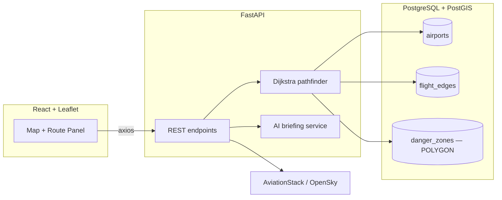

# Risk Aggregator v2.5 — Global Threat & Routing Engine

A spatial routing engine that plans flight paths around real-world hazards.
Given an origin and destination airport, it computes both the direct route
and a hazard-aware route, using PostGIS geometry to detect when a path
crosses an active danger zone (conflict airspace, severe weather) and a
custom Dijkstra implementation to route around it.

<!--
  TODO: add a screenshot/GIF here — drop the file at docs/screenshot.png and
  add `` above this comment.
  Run the app (see Quickstart) and grab one showing a rerouted path,
  e.g. IST -> DXB or IST -> HND.
-->

## What it does

1. Scheduled workers continuously ingest **live hazard data** — real
   international SIGMET polygons (thunderstorms, volcanic ash, tropical
   cyclones) from the Aviation Weather Center and M4.5+ earthquakes from
   USGS — as time-bounded danger zones, alongside a few labeled seed
   scenarios for a deterministic demo.
2. Pick an origin and destination from 36 seeded global airport hubs. The
   backend runs Dijkstra twice — once ignoring risk, once penalizing edges
   whose geodesic path crosses an active zone — and returns both paths with
   an honest verdict (CLEAR / REROUTED / NO_SAFE_PATH).
3. The frontend renders both on a dark-mode Leaflet map: the blocked direct
   path (dashed red), the safe rerouted path (solid blue), a per-corridor
   threat breakdown computed from the actual zones involved, an
   AI-generated briefing built from server-derived facts, and real
   scheduled flights on the route (AviationStack).

## Architecture



| Layer | Stack |
|---|---|
| Frontend | React, React-Leaflet, Axios, custom CSS (dark-mode) |
| Backend | FastAPI, SQLAlchemy, GeoAlchemy2, Alembic migrations |
| Database | PostgreSQL + PostGIS (`POINT` airports, `POLYGON` danger zones, GIST spatial indexes) |
| Routing | Hand-rolled Dijkstra (`backend/services/pathfinder.py`) over geodesic zone intersections computed in PostGIS |
| Ingestion | APScheduler workers with idempotent upserts (`ON CONFLICT external_id DO UPDATE`) + zone expiry sweep |
| Hazard feeds | **AWC international SIGMETs** (live hazard polygons, no key) + **USGS M4.5+ earthquakes** (live GeoJSON, no key) |
| Live data | OpenSky Network (aircraft positions, TTL-cached 30s), AviationStack (scheduled flights, TTL-cached 6h) |
| AI | LLM route briefing built from server-derived facts only (model via `OPENAI_MODEL`, 10s timeout, cached), deterministic offline fallback when no API key is set |

## How routing works

A single SQL query annotates every `flight_edge` with the danger zones its
flight path crosses, using `ST_Intersects` on PostGIS `geography` — which
treats the segment between two airports as a great-circle arc (the path a
plane actually flies), not a straight line in lon/lat space. Only active,
unexpired zones count. Each edge is weighted
`distance × (1 + λ · Σ zone_severity)`, so severity scales the penalty.

Dijkstra runs twice — once ignoring risk (`standard_route`), once with
penalties (`safe_route`) — and the verdict comes from what the winning path
*actually crosses*, never from whether the two paths differ:
`CLEAR` (direct path is safe), `REROUTED` (a clear detour exists), or
`NO_SAFE_PATH` (every option crosses active threat airspace — reported
honestly, with the zones named).

See [`backend/services/pathfinder.py`](backend/services/pathfinder.py).

## Quickstart

### Backend

```bash
# 1. Local PostgreSQL + PostGIS (one-time)
brew install postgresql@17 postgis
brew services start postgresql@17
createdb risk_aggregator
psql -d risk_aggregator -c "CREATE EXTENSION postgis;"

# 2. Python environment
cd backend
python3 -m venv venv
venv/bin/pip install -r requirements.txt
cp .env.example .env   # defaults already point at the local DB above

# 3. Build the schema (Alembic migrations), seed data, run
venv/bin/alembic upgrade head
venv/bin/python seed.py
venv/bin/uvicorn main:app --reload --port 8000
```

API docs: `http://localhost:8000/docs`

### Frontend

```bash
cd frontend
npm install
npm run dev
```

App: `http://localhost:5173`

### Optional: live flight data

Set `AVIATIONSTACK_KEY` in `backend/.env` (free tier at
[aviationstack.com](https://aviationstack.com)) to see real scheduled
flights on the selected route. OpenSky aircraft positions work with no key.

## API

| Endpoint | Description |
|---|---|
| `GET /api/airports` | All seeded airports with coordinates and risk metadata |
| `GET /api/danger-zones` | All danger zone polygons as GeoJSON |
| `POST /api/route/calculate` | `{origin, destination}` → standard + safe route |
| `POST /api/route/briefing` | AI-generated summary of a computed route |
| `GET /api/live-flights` | Live aircraft positions (OpenSky) |
| `GET /api/live-flights/{dep}/{arr}` | Real scheduled flights for a route (AviationStack) |

## Known limitations

Being upfront about the current state rather than overselling it:

- **The routing model is 2D and binary.** Real dispatchers route around
  weather with altitude changes and departure timing; this model treats a
  zone crossing as a flat penalty. When the tropical thunderstorm belt is
  carpeted in SIGMETs (most days), many equatorial corridors honestly
  report `NO_SAFE_PATH` where a real airline would fly over or wait out
  the cell. Severity thresholds / vertical awareness are future work.
- **SIGMET polygons spanning the antimeridian** (±180° longitude) are
  stored as-is and may render or intersect oddly.
- **No automated tests yet.** `backend/test_route.py` is a manual smoke
  script, not a test suite; verification so far has been live end-to-end
  checks.
- **No auth or rate limiting** on the API.

## Roadmap

1. ~~Explicit route-safety verdict + geodesic zone intersection + severity-weighted scoring~~ ✅
2. ~~Alembic migrations, foreign keys, idempotent zone ingestion → scheduled updates re-enabled~~ ✅
3. ~~Live SIGMET/earthquake feeds, computed threat matrix, hardened AI briefing, TTL caching~~ ✅
4. Tests, CI, Docker, deployed demo
